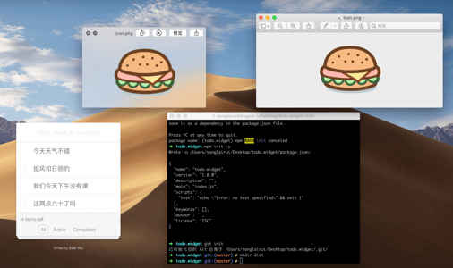

# Mac 仪表盘 （Vue TodoMVC）

> Vue 官方 TodoMVC 示例转为 mac 挂件

TodoMVC.wdgt 直接安装

- [x] 减少阴影
- [x] 减小字体

## 使用效果

显示在桌面上

## 使用说明

将挂件放在桌面上：
0. 系统偏好设置，调度中心设置为 **`叠加`**
1. 打开终端，执行如下命令
```bash
defaults write com.apple.dashboard devmode YES && killall Dock
```
2. 快捷键打开叠加的调度中心

    `Fn + F12`

3. 添加widget，点击并保持拖动widget
4. 再按快捷键关闭调度中心，widget保持在桌面上


参考： [https://www.hongkiat.com/blog/dashboard-widgets-desktop/](https://www.hongkiat.com/blog/dashboard-widgets-desktop/)